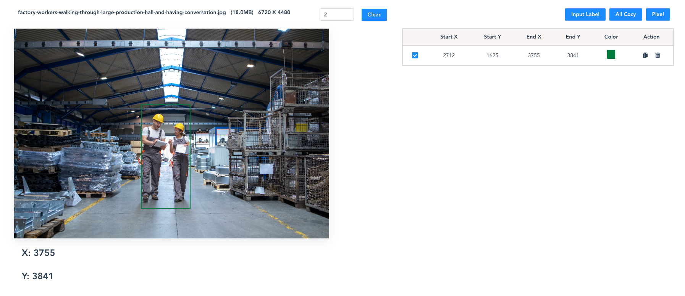
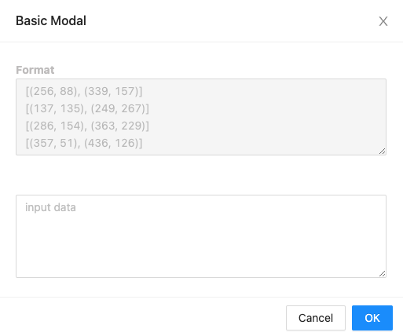

# Image Draw

> node: v16.19.0
>
> npm: v8.19.3
>
> vue/cli: v5.0.8
>
> sass: v1.32


## 목차

1. 기능 소개
2. 서버 실행 방법 
3. 사용 방법


## 1. 기능

- 이미지 위에 rect (사각형)을 그릴 수 있다.
  - 사각형 수정 (크기, 이동) 가능
  - 사각형 지우기 가능
- 그린 사각형을 통해 좌표를 얻을 수 있다.
  - 마우스 오버시 좌표 표시
- 좌표 입력을 통해 사각형을 그릴 수 있다.


## 2. 서버 실행 방법

- 모듈 설치

  ```bash
  npm i
  ```

- 서버 실행

  ```bash
  npm run serve
  ```


## 3. 사용방법

1. 사각형 그리기

   - 이미지 업로드 후 `w`를 눌러 그리기 모드 변환 후 사각형을 그린다.
     - 그리기 모드는 마우스 포인터가 연필이다.
   - 사각형을 그리면 오른쪽의 좌표가 나타난다. (좌표는 Pixel 단위 또는 비율 단위)
     - 좌상 좌표: start_x, start_y
     - 우하 좌표: end_x, end_y

   

2. 사각형 수정하기

   - `esc`를 눌러 수정 모드로 변환한다.
     - 수정모드는 마우스 포인터가 `pointer`이다.
   - 사각형의 모서리는 사각형의 크기를 조절할 수 있으며,  사각형의 나머지 부분은 사각형을 이동시킬 수 있다.

3. 사각형 색상 바꾸기

   - 오른쪽 표에서 `color`을 통해 사각형의 색상을 변경할 수 있다.

4. 좌표 복사

   - 복사 아이콘을 클릭하면 해당 사각형의 좌표를 복사 할 수 있다.

     `[(start_x, start_y), (end_x, end_y)]`

5. 사각형 지우기

   - 휴지통 아이콘을 클릭하면 해당 사각형을 지울 수 있다.

6. 좌표를 통해 사각형 그리기

   - `Input Label` 버튼 클릭

   - 예시와 같은 형식으로 좌표 입력 후 `OK` 버튼 클릭

     


